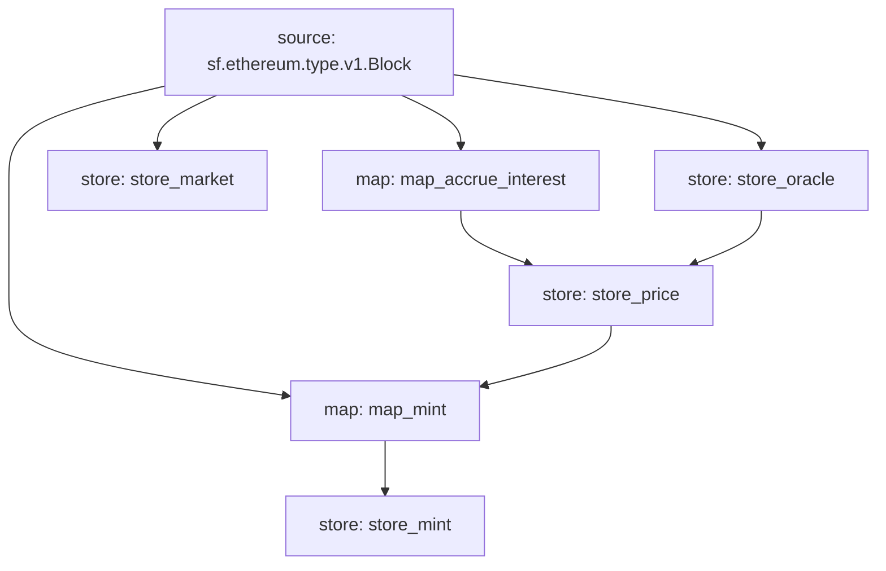

# CompoundV2 Substreams

Ongoing effort to index Compound V2 using substreams.



## Quick Start

### Install

Run `go install ./cmd/substreams` under `substreams` repo `develop` branch to get the latest `substreams` cli.

Run `brew install bufbuild/buf/buf` to install `buf`.

### Build

Generate src/pb

```bash
make codegen
```

Build

```bash
make build
```

### Run

```bash
sftoken
substreams run -e api-dev.streamingfast.io:443 substreams.yaml map_market_listed,store_market --start-block 7710778 --stop-block +10
```

## Troubleshooting

Running `store_*` module could produce the below error. Just ignore it and retry.

```
Error: rpc error: code = Unknown desc = error building pipeline: synchronizing stores: from worker: calling back scheduler: squashing: merging partials: initializing next partial store "store_transfers": storage file 0012289000-0012288000.partial: not found
```

## Issues

## Wishlist

### Common event mapper (Credits to Sebastian)

Instead of doing [this](https://github.com/streamingfast/substreams-template/blob/2cd9e4dcfaf6ff2ab2ca76a59b114f2ccb2a5b2e/src/lib.rs#L15), how about

```rust
#[substreams::handlers::map]
fn map_pairs(block: eth::Block) -> Result<Vec<Uniswap::Pair>, Error> {
    Ok(abi::factory::events::PairCreated::filter_logs(address, block, |event, log| {
        Some(uniswap::Pair {
            address: event.pair,
            token0: event.token0,
            token1: event.token1,
            ordinal: log.ordinal,
        })
    }))
}
```

3 things:
- Result type as a "list of things" (instead of having to create a "pluralized" proto definiton for every mapper).
- Utility functions on the generated code for the majority use cases (e.g. filtering logs).
- Decode & encode store values / rpc responses automatically.

[Thread](https://0xbe1.slack.com/archives/C03B2US85J4/p1655885793387659).
